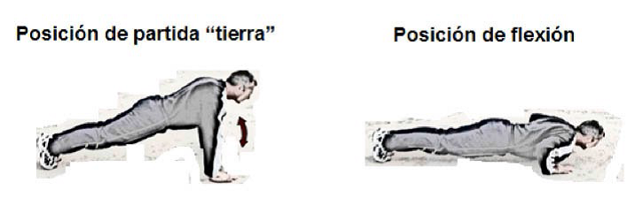

# PRUEBAS FISICAS PARA LAS FUERZAS ARMADAS

La OM 54/2014, de 11 de noviembre, viene a regular las pruebas físicas a realizar periódicamente por el personal de las FAS a fin de evaluar de forma objetiva su adecuada aptitud física.

A estos efectos, el artículo 4 establece unas tablas de puntuación por marcas, sexo y edades, que se recogen en el Anexo II de la OM y señala que, con carácter general, para conseguir la declaración de aptitud será preciso alcanzar la puntuación de 20 puntos en cada prueba.

Con estas premisas, las marcas mínimas serán las que hemos destacado en la siguiente tabla, por ejercicio genero y edad:

## FUERZA. FLEXO-EXTENSIONES DE BRAZOS EN SUELO EN UN TIEMPO MAXIMO DE DOS MINUTOS (2 min.)
  

## FUERZA. FLEXIONES DE TRONCO (ABDOMINALES) EN TRES MINUTOS (3 min.)

  

## RESISTENCIA: 2000 o 6000 M LISOS
  

## VELOCIDAD. CIRCUITO DE AGILIDAD–VELOCIDAD (CAV). Obligatorio sólo para menores de 45 años.

  

:es: :sun_with_face: :+1:
